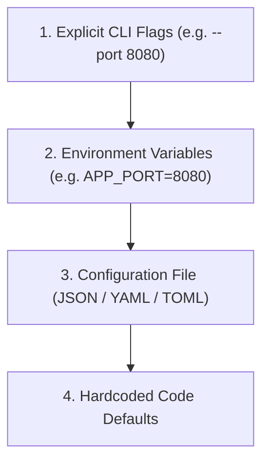

# CLI Interface, Flags & Options Specification — {{PROJECT_NAME}}

> Canonical specification for command-line syntax, argument parsing conventions, subcommands, configuration precedence, and interactive UX.

---

## 1. Command Syntax & Execution Matrix

- **Project Name:** `{{PROJECT_NAME}}`
- **Primary Binary / Command Alias:** `{{COMMAND_NAME}}`
- **Implementation Language / Runtime:** `{{CLI_LANGUAGE}}`
- **Primary Run Mode:** `{{RUN_MODE}}`
- **Log Destination:** `{{LOG_OUTPUT_TARGET}}`

### Standard Invocation Syntax:
```bash
{{COMMAND_NAME}} [GLOBAL_OPTIONS] [SUBCOMMAND] [SUBCOMMAND_OPTIONS] [ARGUMENTS...]
```

---

## 2. Standard Global Flags & Conventions

Every CLI tool must support these standard POSIX-compliant options:

| Flag (Short / Long) | Type | Default | Description |
| :--- | :--- | :--- | :--- |
| `-h, --help` | Boolean | `false` | Display command usage, subcommands, flags, and examples, then exit `0`. |
| `-V, --version` | Boolean | `false` | Display tool name, semantic version, and commit hash, then exit `0`. |
| `-v, --verbose` | Boolean | `false` | Enable verbose operational and debug logging to stderr. |
| `-q, --quiet` | Boolean | `false` | Suppress non-essential output; print only errors and requested data. |
| `-n, --dry-run` | Boolean | `false` | Simulate execution, parse inputs, and print planned mutations without side effects. |
| `--config <path>` | String | `~/.config/{{COMMAND_NAME}}/config.json` | Path to explicit configuration file. |
| `--format <json\|yaml\|table>` | String | `table` | Machine-readable or human-formatted stdout presentation. |

---

## 3. Configuration Hierarchy (Precedence Order)

When resolving settings, configurations are evaluated in strict cascading order (highest priority wins):



1. **CLI Arguments:** Directly passed flags always override any other source.
2. **Environment Variables:** Prefixed with upper-case command name (e.g. `{{COMMAND_NAME}}_CONFIG_PATH`).
3. **Local Project Config:** `./.{{COMMAND_NAME}}rc` in current working directory.
4. **User Home Config:** `~/.config/{{COMMAND_NAME}}/config.json`.
5. **System Defaults:** Safe baseline values embedded in application source.

---

## 4. Subcommands & Grouping

If `{{COMMAND_NAME}}` provides multiple operational workflows, organize them into descriptive noun-verb subcommands:

```bash
# Example Subcommand Hierarchy
{{COMMAND_NAME}} run [options]       # Execute primary automation cycle
{{COMMAND_NAME}} ingest <source>     # Ingest raw batch records
{{COMMAND_NAME}} status              # Check health and pipeline progress
{{COMMAND_NAME}} config show         # Display active configuration
```
