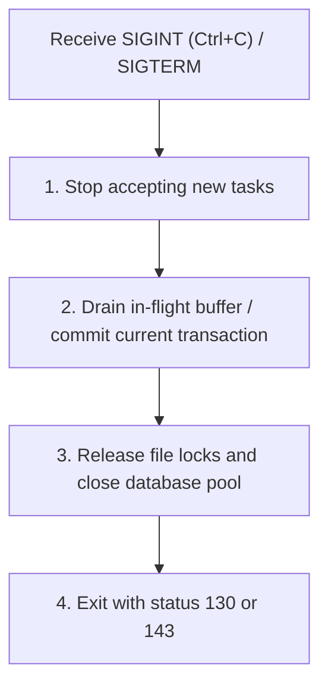

# Process Lifecycle, Streams & Exit Codes — {{PROJECT_NAME}}

> Technical specification for UNIX standard streams separation, process exit codes, POSIX signal handling, and graceful shutdown.

---

## 1. Standard Streams Separation (Unix Philosophy)

To enable composability with shell pipelines (`|`, `xargs`, `jq`), `{{COMMAND_NAME}}` strictly isolates data output from logging:

- **`stdout` (Standard Output):** Reserved exclusively for requested query results or transform output. When piped, only formatted data (e.g. raw JSON or CSV) is written.
- **`stderr` (Standard Error):** Reserved for progress bars, informational banners, diagnostics, warnings, and error messages.
- **`stdin` (Standard Input):** When invoked without argument targets or with `-` as path, read piped stream data sequentially.

```bash
# Composable pipeline example
{{COMMAND_NAME}} ingest - < input.json | jq '.processed_ids'
```

---

## 2. Standard Process Exit Codes

Every execution must terminate with a deterministic exit code:

| Code | Meaning | Example Trigger |
| :---: | :--- | :--- |
| `0` | **Success** | Task completed without errors. |
| `1` | **General Execution Error** | Network timeout, database write rejection, unhandled exception. |
| `2` | **Misuse of Shell Builtins / Syntax Error** | Missing mandatory flag, unknown argument, invalid flag type. |
| `3` | **Validation Failure** | Payload failed schema validation; data quarantined. |
| `126` | **Command Invoked Cannot Execute** | Permission denied on worker executable. |
| `127` | **Command Not Found** | Dependency binary missing from `$PATH`. |
| `130` | **Terminated by Control-C (`SIGINT`)** | User pressed Ctrl+C; graceful cancellation executed. |
| `143` | **Terminated by Supervisor (`SIGTERM`)** | Container or systemd stopped service gracefully. |

---

## 3. Signal Handling & Graceful Termination

Automation tools and daemons must never terminate abruptly during writes or transactions:



- **Grace Period Timeout:** Allow up to 10 seconds for running items to finish.
- **Force Kill (`SIGKILL` / double Ctrl-C):** If a second `SIGINT` is received during the drain cycle, abort immediately with exit code `130`.

---

## 4. Idempotency & Safe Retries

All CLI operations that modify external systems (databases, APIs, filesystems) must be strictly idempotent:
- Running the exact same command multiple times with identical inputs must produce the exact same end state without duplicate records.
- Use unique idempotency keys (e.g. SHA-256 hash of record payload) when dispatching requests to upstream endpoints.
