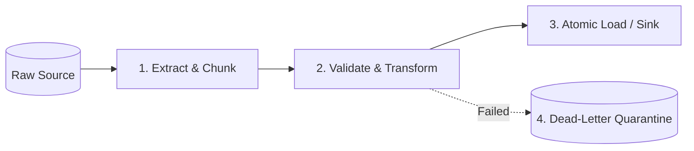

# Batch Ingestion & Data Pipeline Specification — {{PROJECT_NAME}}

> Architecture specification for processing batch datasets, streaming chunk limits, backpressure handling, and error quarantine.

---

## 1. Pipeline Stages & Lifecycle

Data pipelines executed by `{{COMMAND_NAME}}` follow a strict four-stage processing model:

1. **Extract & Chunk:** Stream input files or API records in discrete chunks (default: 500 records per chunk) to cap resident memory usage.
2. **Validate & Transform:** Validate incoming schemas. Format data into normalized target models.
3. **Atomic Load:** Ingest chunks into destination storage within database transactions or bulk API payloads.
4. **Quarantine:** Isolate malformed or rejected records immediately without halting the processing of valid items.

---

## 2. Memory Limits & Streaming Safety

To prevent Out-Of-Memory (OOM) fatal crashes on large datasets:
- **Never Slurp Entire Files:** Prohibit `fs.readFileSync()` or loading multi-gigabyte files into whole-file arrays in memory.
- **Backpressure Mechanism:** Pause reader stream if the downstream processing worker pool is at maximum concurrency.
- **Max Heap / Resident Set Size (RSS):** Enforce ceiling limit (e.g. max 512 MB memory footprint).

---

## 3. Error Handling & Quarantine Protocol

When an individual record fails transformation or sink ingestion:
1. **Never Silently Discard Data:** Log an explicit warning to `stderr` with line number or record identifier.
2. **Dead-Letter Directory:** Write failed records along with rejection error reasons to `./quarantine/<timestamp>-<job_id>.jsonl`.
3. **Failure Threshold:** If more than 5% of total records fail schema validation, abort the entire batch and roll back open transactions.
