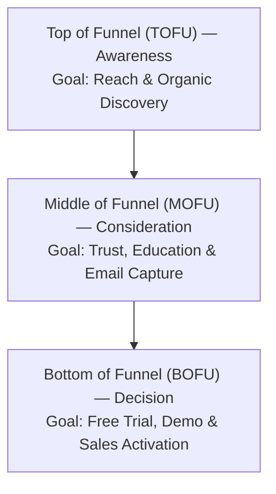

# Content Calendar & Editorial Themes Specification — {{PROJECT_NAME}}

> Canonical specification for editorial scheduling cadence, content pillars, audience funnel mapping, and production lifecycle workflows.

---

## 1. Content Mission & Strategic Pillars

- **Project Name:** `{{PROJECT_NAME}}`
- **Brand Editorial Voice:** `{{BRAND_TONE}}`
- **Core Content Pillars:** `{{CONTENT_PILLARS}}`
- **Primary Channels:** `{{PRIMARY_CHANNELS}}`

### Strategic Pillar Breakdown:
1. **Pillar 1 (Industry Insights & Trends):** Establishing thought leadership and educating the market on evolving challenges.
2. **Pillar 2 (How-To Tutorials & Playbooks):** Actionable, step-by-step technical or operational guides delivering immediate utility.
3. **Pillar 3 (Case Studies & Transformations):** Concrete proof points showcasing before-and-after outcomes and user success.
4. **Pillar 4 (Product & Feature Deep Dives):** Demonstrating how `{{PROJECT_NAME}}` solves specific operational bottlenecks.

---

## 2. Audience Funnel Mapping

Every content piece must be assigned a deliberate stage within the audience conversion journey:

| Funnel Stage | Primary Content Types | Target Metric | Primary CTA |
| :--- | :--- | :--- | :--- |
| **TOFU (Awareness)** | SEO articles, social threads, short videos | Impressions, pageviews, shares | Follow / Bookmark / Read More |
| **MOFU (Consideration)** | In-depth playbooks, comparison guides, newsletters | Subscribers, downloads, time on page | Subscribe to Newsletter / Download Guide |
| **BOFU (Decision)** | Customer case studies, feature walkthroughs, ROI calculators | Trial signups, demo requests | Start Free Trial / Contact Sales |

---

## 3. Editorial Production Lifecycle

All content moves through a standardized six-step progression:

1. **Ideation & Scoring:** Pitch topic against content pillars and keyword demand; confirm fit in the editorial backlog.
2. **Research & Outline:** Establish target angle, search intent, key statistics, and heading hierarchy (`H1`, `H2`, `H3`).
3. **Drafting:** Write content adhering strictly to `{{BRAND_TONE}}` and formatting guidelines.
4. **Editorial & Fact-Check Review:** Validate facts, links, and tone before sign-off.
5. **Publishing & On-Page QA:** Format in CMS, optimize meta tags, set canonical URL, verify mobile readability.
6. **Distribution & Amplification:** Execute multi-channel syndication and engage with audience comments.

---

## 4. Editorial Calendar Cadence

| Cadence | Deliverable Type | Channel | Responsible Role |
| :--- | :--- | :--- | :--- |
| **Weekly (Tuesday)** | 1x Long-form Deep-Dive (1,500+ words) | Main Blog / Website | Content Writer |
| **Weekly (Thursday)** | 1x Curated Editorial Newsletter | Email Channel | Content Editor |
| **Daily (Mon–Fri)** | 2x Short-form Insights / Threads | Social Channels | Social Media Specialist |
| **Monthly** | 1x Benchmark Study / Whitepaper | Resource Library | Research & Growth Lead |
