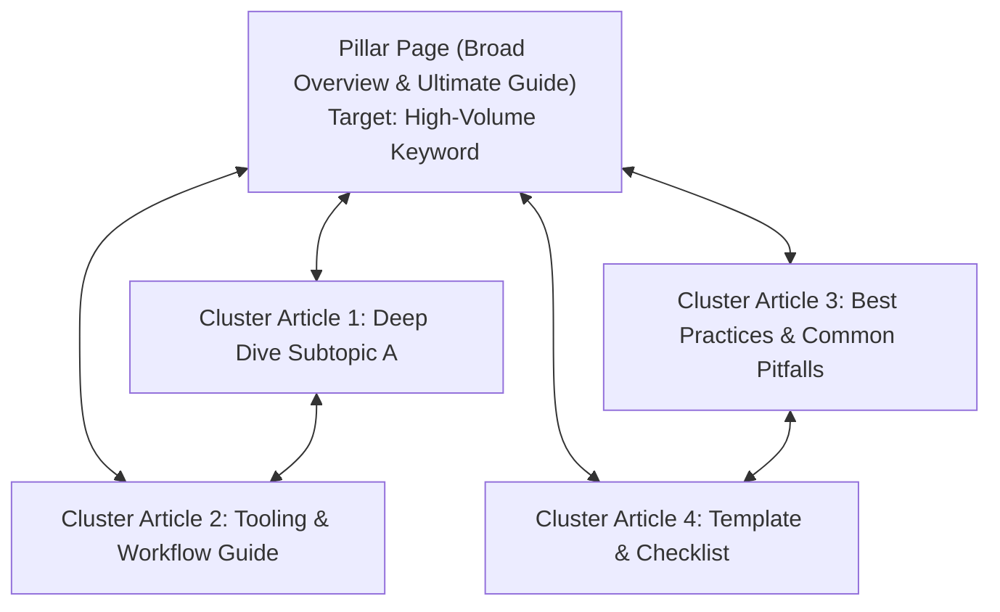

# SEO Keyword Strategy & Topic Clusters — {{PROJECT_NAME}}

> Technical specification for organic search optimization, search intent mapping, topic cluster internal linking, and on-page checklist.

---

## 1. Target Keywords & Search Intent Matrix

- **Primary Keyword Clusters:** `{{TARGET_KEYWORDS}}`
- **Core Intent Focus:** Informational (How-To / Conceptual) and Commercial (Comparison / Evaluation).

| Target Keyword Cluster | Search Intent | Monthly Volume Tier | Difficulty | Target Content URL |
| :--- | :--- | :---: | :---: | :--- |
| `{{TARGET_KEYWORDS}}` (Core) | Commercial / Transactional | High | Medium/High | `/solutions/{{PROJECT_NAME}}` |
| "How to optimize [topic]" | Informational | Medium | Low/Medium | `/blog/how-to-guide` |
| "Best tools for [topic]" | Commercial Investigation | Medium | Medium | `/blog/best-tools-comparison` |
| "[Topic] template / framework" | Informational / Utility | High | Low | `/resources/free-framework` |

---

## 2. Topic Cluster Architecture (Hub & Spoke)

Organize related content into self-reinforcing topic clusters anchored by a comprehensive pillar page:

- **Hyperlink Rule:** Every cluster article must link back to the pillar page using descriptive keyword-rich anchor text.
- **Cross-Linking:** Cluster articles covering adjacent concepts must interlink directly to build topical authority.

---

## 3. On-Page Technical SEO Checklist

Every piece of digital content published to the web must fulfill this verification checklist:

| Check Item | Requirement | Verification Method |
| :--- | :--- | :--- |
| **Title Tag** | Under 60 characters, primary keyword in first half | Inspect HTML `<title>` |
| **Meta Description** | 140–155 characters, clear benefit and call-to-action | Inspect `<meta name="description">` |
| **H1 Tag** | Exactly one `<h1>` per page, matching search intent | DOM audit |
| **Semantic Heading Hierarchy** | Proper nesting (`H1` -> `H2` -> `H3`), no skipped levels | Heading audit |
| **URL Slug** | Clean, lowercase, hyphen-separated, keyword-focused | Browser address bar |
| **Image Alt Text** | Descriptive alternative text for all informational images | Inspect `` |
| **Structured Data (Schema)** | Valid `Article` or `FAQPage` JSON-LD schema | Google Rich Results Test |
| **Internal & External Links** | 2–4 links to internal relevant pages, 1–2 credible outbound links | Link scan |
