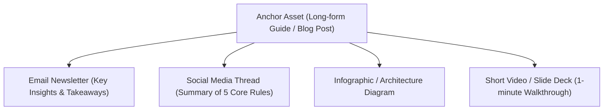

# Multi-Channel Distribution & Content Atomization — {{PROJECT_NAME}}

> Operational protocol for content syndication, cross-channel repurposing workflows, publishing cadence, and performance analytics.

---

## 1. Content Atomization Workflow (1-to-Many)

Every core long-form content asset is decomposed systematically into multiple native social and broadcast formats:

### Transformation Playbook:
1. **Core Guide:** 1,500-word deep dive published to canonical website URL.
2. **Newsletter Adaptation:** 400-word conversational executive summary sent to subscriber list with direct link to full guide.
3. **Social Thread / Carousel:** 5–7 slide visual post highlighting the core contrast, framework, or checklist.
4. **Community Syndication:** Curated answer linking back to resource on relevant developer or practitioner forums.

---

## 2. Channel Matrix & Publishing Cadence

- **Primary Channels:** `{{PRIMARY_CHANNELS}}`

| Channel | Native Format | Optimal Frequency | Primary Objective |
| :--- | :--- | :--- | :--- |
| **Official Blog** | Long-form markdown articles | 1x / week | Organic search authority, evergreen reference |
| **Email Newsletter** | Curated text digest | 1x / week | Subscriber retention, direct referral traffic |
| **Professional Network (LinkedIn)** | Document carousels, text posts | 3x / week | B2B decision-maker reach, partnership inquiries |
| **Social Micro-updates (X)** | Bite-sized threads, code snippets | Daily | Real-time community engagement, product feedback |

---

## 3. Distribution KPI Tracking

Evaluate distribution effectiveness using this standardized reporting scorecard:

| KPI Category | Metric Identifier | Measurement Frequency | Health Benchmark |
| :--- | :--- | :--- | :--- |
| **Reach & Discovery** | Unique Organic Visitors | Weekly | +10% MoM growth |
| **Engagement** | Average Time on Page / Scroll Depth | Weekly | > 2.5 minutes, 60% scroll |
| **Conversion** | Newsletter Opt-In Rate | Monthly | > 2.5% of total blog visitors |
| **Pipeline Impact** | Product Signups Attributed to Content | Monthly | Quantified in CRM |
