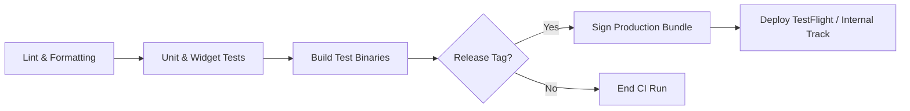

# Build, Code Signing & Distribution — {{PROJECT_NAME}}

> Technical specifications for cryptographic code signing, CI/CD automated build pipelines, test distribution tracks, and release versioning.

---

## 1. Code Signing & Key Management

Never commit private signing keys, keystores, or certificates to source control. Store secrets in encrypted CI vault or protected secret managers.

### 1.1. iOS Signing (Apple Developer)
- **Certificates:** Apple Distribution Certificate for release builds, Apple Development for debug.
- **Provisioning Profiles:** App Store Distribution profile bound to `{{APP_BUNDLE_ID}}`.
- **Automated Management:** Use Fastlane Match via private Git repository or App Store Connect API keys.

### 1.2. Android Signing (Google Play)
- **Upload Key:** Generate PKCS12 / JKS keystore for local and CI uploads.
  ```bash
  keytool -genkey -v -keystore release-upload.jks -alias upload -keyalg RSA -keysize 2048 -validity 10000
  ```
- **Play App Signing:** Google Play manages final device-optimized APK signing keys. Developers upload encrypted `.aab` (Android App Bundle).
- **Environment Variables:** `ANDROID_KEYSTORE_BASE64`, `ANDROID_KEYSTORE_PASSWORD`, `ANDROID_KEY_ALIAS`, `ANDROID_KEY_PASSWORD`.

---

## 2. Automated Build Pipeline (CI/CD)

Every pull request and release tag triggers automated validation:



### Build Commands:
- **Android App Bundle:**
  ```bash
  # Flutter
  flutter build appbundle --release --obfuscate --split-debug-info=./build/symbols
  # React Native / Gradle
  ./android/gradlew bundleRelease
  ```
- **iOS Archive & IPA:**
  ```bash
  # Fastlane execution
  bundle exec fastlane ios build_and_upload
  ```

---

## 3. Distribution Tracks & Rollout Cadence

1. **Internal Development (Nightly):** Automated builds distributed to core team members via Firebase App Distribution or local install.
2. **Beta Testing (Weekly):** Deployed to Apple TestFlight (Internal + External Groups) and Google Play Closed Testing Track.
3. **Staged Production Rollout:**
   - Day 1: 5% of users
   - Day 2: 10% of users
   - Day 3: 20% of users
   - Day 5: 50% of users
   - Day 7: 100% full release
   - *Rollout Halt Trigger:* If crash rate exceeds 0.2%, pause staged rollout immediately.

---

## 4. Versioning Conventions

Follow Semantic Versioning paired with monotonically increasing build numbers:
- **Format:** `MAJOR.MINOR.PATCH+BUILD_NUMBER` (e.g. `1.2.0+142`)
- **Version Name (`1.2.0`):** Visible to end users in store listings.
- **Build Number (`142`):** Integer incremented on every build artifact; strictly unique per submission.
