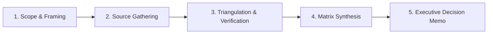

# Research Methodology & Scope Framework — {{PROJECT_NAME}}

> Canonical specification for research problem framing, investigative hypotheses, methodology design, and scoping boundaries.

---

## 1. Research Objectives & Core Topic

- **Project Name:** `{{PROJECT_NAME}}`
- **Core Research Topic:** `{{RESEARCH_TOPIC}}`
- **Primary Methodology:** `{{RESEARCH_METHODOLOGY}}`
- **Target Executive Audience:** `{{EXECUTIVE_AUDIENCE}}`

### Core Research Questions (CRQs):
1. **CRQ 1 (State of Market/Problem):** What are the prevailing structural conditions, pain points, and current solutions in this domain?
2. **CRQ 2 (Comparative Differentiation):** How do alternative approaches or competitors perform against core evaluation criteria?
3. **CRQ 3 (Strategic Recommendation):** What actionable, evidence-backed strategy should `{{EXECUTIVE_AUDIENCE}}` adopt to maximize outcome?

---

## 2. Investigative Hypotheses & Validation Gates

Formulate testable hypotheses before data collection to avoid confirmation bias:

| Hypothesis ID | Statement | Required Proof Criterion | Validation Outcome |
| :--- | :--- | :--- | :---: |
| **H-01** | The primary user bottleneck is operational latency rather than feature absence. | > 60% of interview respondents rank turnaround time as top frustration. | [ ] |
| **H-02** | Incumbent market solutions suffer from prohibitive cost and steep learning curves. | Documented pricing tiers and onboarding onboarding time benchmarks. | [ ] |
| **H-03** | Adopting a standardized framework reduces implementation errors by > 40%. | Empirical test comparison or historical case study metrics. | [ ] |

---

## 3. Scope Boundaries & Delimitations

To maintain rigorous depth and prevent scope creep:

### In Scope:
- Analysis of validated market participants and public filings within the last 24 months.
- Direct practitioner interviews and structured quantitative survey datasets.
- Economic and operational trade-offs relevant to `{{EXECUTIVE_AUDIENCE}}`.

### Out of Scope:
- Speculative macro-economic projections extending beyond a 3-year horizon.
- Unverified anecdotal claims or unsourced blog rumors.
- Implementation or engineering execution of the recommendations (covered under separate operational harness).

---

## 4. Research Governance Lifecycle

