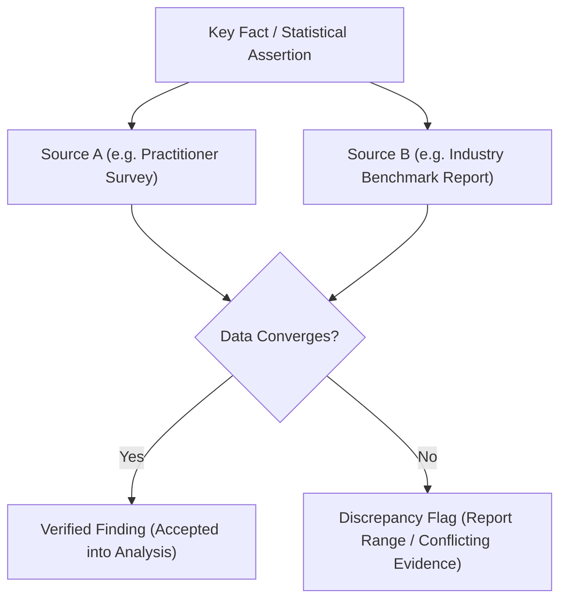

# Data Gathering, Sources & Verification Protocol — {{PROJECT_NAME}}

> Technical specification for source credibility tiers, evidence triangulation, citation standards, and data integrity.

---

## 1. Source Credibility Hierarchy

All findings and strategic assertions must link directly to verified sources within this evaluation hierarchy:

- **Primary Sources:** `{{PRIMARY_SOURCES}}`

| Source Tier | Credibility Rating | Accepted Source Types | Usage Rules |
| :--- | :---: | :--- | :--- |
| **Tier 1 (Authoritative)** | Gold Standard | Direct stakeholder interviews, audited financial filings, official regulatory registries, peer-reviewed academic papers. | Accepted as single-source ground truth when methodology is verified. |
| **Tier 2 (Industry / Expert)** | High | Recognized industry analyst reports (e.g. Gartner, Forrester), vetted benchmark data, official vendor technical documentation. | Requires cross-referencing against at least one other independent report. |
| **Tier 3 (Observational)** | Supporting | Reputable technology media, industry blogs, case study summaries, community surveys. | Contextual background only; cannot serve as the sole justification for a strategic claim. |
| **Tier 4 (Unverified)** | Prohibited | Anonymous forum threads, speculative social media posts, unsourced press releases. | Strictly excluded from analysis findings. |

---

## 2. Triangulation & Fact-Checking Protocol

Every high-stakes factual claim (market size, error rates, financial figures) must undergo **Dual-Source Triangulation**:

---

## 3. Citation & Provenance Standard

Every data entry in research artifacts must include complete citation provenance:

- **Format:** `[Source Name] (Author / Organization, Publication Date). Title of Work. URL / DOI (Archived: YYYY-MM-DD).`
- **Example:** `[SEC EDGAR] (Acme Corp, 2025-03-15). 10-K Annual Report. https://sec.gov/... (Archived: 2026-01-10).`

---

## 4. Anonymization & Confidentiality

When conducting qualitative user or competitor interviews:
- Protect respondent privacy by masking names and identifying trademarks (e.g. refer to "Interviewee A, Head of Infrastructure at Tier-1 Fintech").
- Store raw unredacted transcripts in access-restricted folders excluded from public version control.
