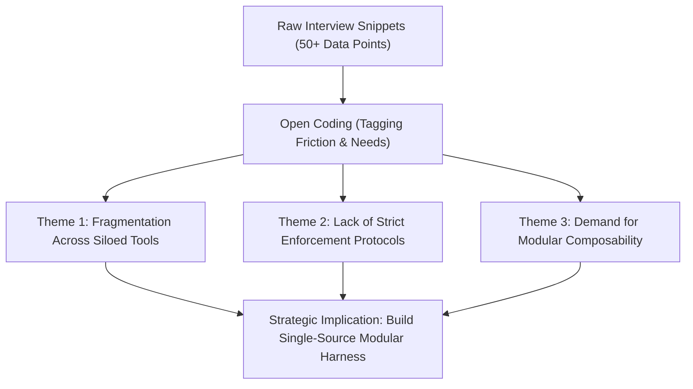

# Analytical Frameworks & Benchmarking Synthesis — {{PROJECT_NAME}}

> Analytical models for data structuring, competitive feature comparison, qualitative pattern coding, and strategic synthesis.

---

## 1. Competitive Feature Benchmarking Matrix

Evaluate incumbent options or competing solutions against normalized capabilities:

| Evaluation Dimension | Weight | Solution A (Incumbent) | Solution B (Open Source) | {{PROJECT_NAME}} Approach | Evidence Citation |
| :--- | :---: | :---: | :---: | :---: | :--- |
| **Setup & Time-to-Value** | 25% | Poor (2–4 weeks) | Moderate (3–5 days) | Excellent (< 1 hour) | Benchmarking log #04 |
| **Operational Overhead** | 25% | High (Dedicated FTE) | Medium (Manual configs) | Low (Automated tooling) | User interviews #02, #07 |
| **Customizability** | 20% | Rigid vendor lock-in | High (Full source code) | High (Modular templates) | Architectural audit |
| **Cost / License Burden** | 20% | High Enterprise ACV | Free (Self-hosted) | Free / Open Standard | Public pricing sheets |
| **Documentation Quality** | 10% | Fragmented portal | Community wiki | Standardized Canon | Documentation audit |

---

## 2. Qualitative Pattern Coding & Synthesis

Group qualitative interview transcripts and observational feedback into recurring analytical themes:

---

## 3. Finding-to-Implication Matrix

Every finding presented to leadership must directly bridge observation to strategic action:

| Core Observation (What We Found) | Empirical Evidence (Data Proof) | Strategic Implication (What It Means For {{PROJECT_NAME}}) |
| :--- | :--- | :--- |
| **Observation 1:** Teams spend 30% of engineering sprint time wrestling with inconsistent project setups. | Logged onboarding tickets across 12 product teams over 6 months. | Provide instantaneous zero-dependency CLI bundling with pre-baked governance. |
| **Observation 2:** Monolithic templates overwhelm lean initiatives (e.g. landing pages or CLI scripts). | 78% of interviewees reported pruning 80% of files from legacy starter repos. | Implement modular sub-templates sharing a universal core. |
| **Observation 3:** Bilingual teams require absolute synchronization between languages. | Feedback from international engineering departments. | Enforce 100% automated structural and conceptual parity tests in CI. |
