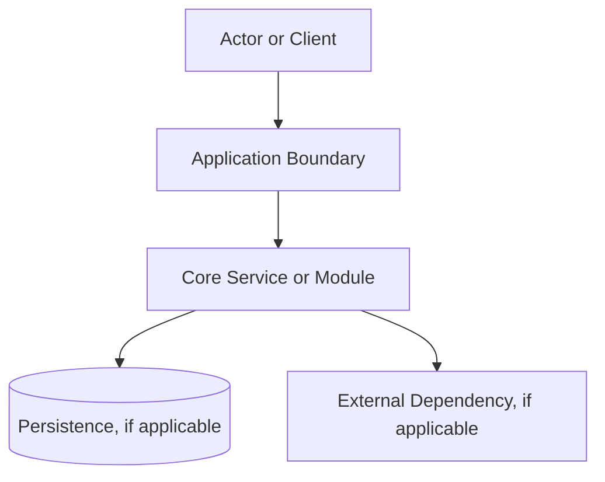
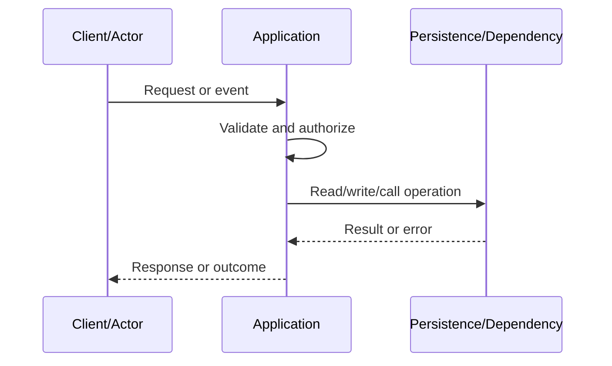

# Architecture & Sequence Diagrams — {{PROJECT_NAME}}

## 1. System Context

Use the following diagram as a baseline and adapt it only to components actually in use:

## 2. Component Responsibilities

- Entry points / Interfaces: {{ENTRYPOINTS}}
- Core application / Service: {{CORE_COMPONENTS}}
- Persistence / Storage: {{PERSISTENCE_COMPONENTS}}
- Asynchronous processing / Queue: {{ASYNC_COMPONENTS}}
- External dependencies: {{EXTERNAL_DEPENDENCIES}}

Each component must maintain a single primary responsibility and well-defined interfaces.

## 3. Primary Sequence Diagram

## 4. Runtime Boundaries

- Runtime / platform: `{{RUNTIME}}`
- Public interfaces: {{PUBLIC_INTERFACES}}
- Internal interfaces: {{INTERNAL_INTERFACES}}
- Configuration & secrets boundary: {{CONFIGURATION_BOUNDARY}}
- Resource limits: {{RESOURCE_LIMITS}}
- Availability & scaling model: {{SCALING_MODEL}}

## 5. Architectural Decisions

Record major decisions affecting compatibility, data integrity, security, operability, or cost. Link decisions to requirement IDs and impacted canonical documents in the [Decision Register](../08-reference/decision-register.md).
