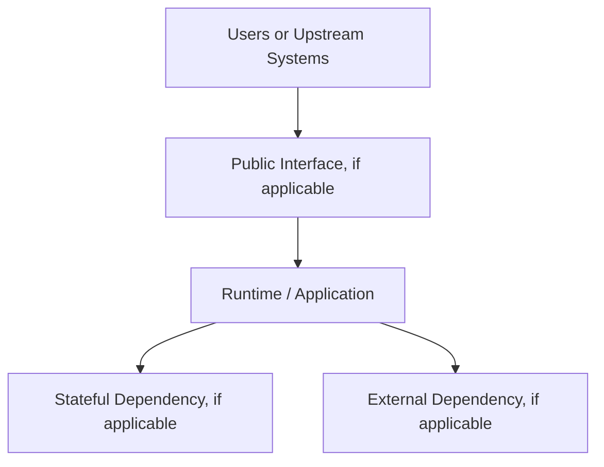

# Server Specs & Deployment Topology — {{PROJECT_NAME}}

## 1. Deployment Context

Target deployment environment: {{DEPLOYMENT_ENVIRONMENTS}}.

Do not add components, ports, or dependencies merely because the template provides them. Document only what the project actually requires.

## 2. Configuration Categories

- Runtime configuration: {{RUNTIME_CONFIGURATION}}
- Secret configuration: {{SECRET_CONFIGURATION}}
- Dependency endpoints: {{DEPENDENCY_ENDPOINTS}}
- Resource limits: {{RESOURCE_LIMITS}}
- Observability configuration: {{OBSERVABILITY_CONFIGURATION}}

All secrets must originate from environment variables or a dedicated secret manager and must never be stored in source code, repositories, artifacts, or logs.

## 3. Deployment Steps

1. {{DEPLOY_STEP_1}}
2. {{DEPLOY_STEP_2}}
3. Validate health checks, dependency connectivity, security controls, and run smoke tests.
4. Record the release version, outcome, and rollback reference.

## 4. Rollback & Compatibility

- Rollback trigger: {{ROLLBACK_TRIGGER}}
- Rollback procedure: {{ROLLBACK_PROCEDURE}}
- Data compatibility / migration rule: {{DATA_COMPATIBILITY_RULE}}
- Downtime expectation: {{DOWNTIME_EXPECTATION}}
