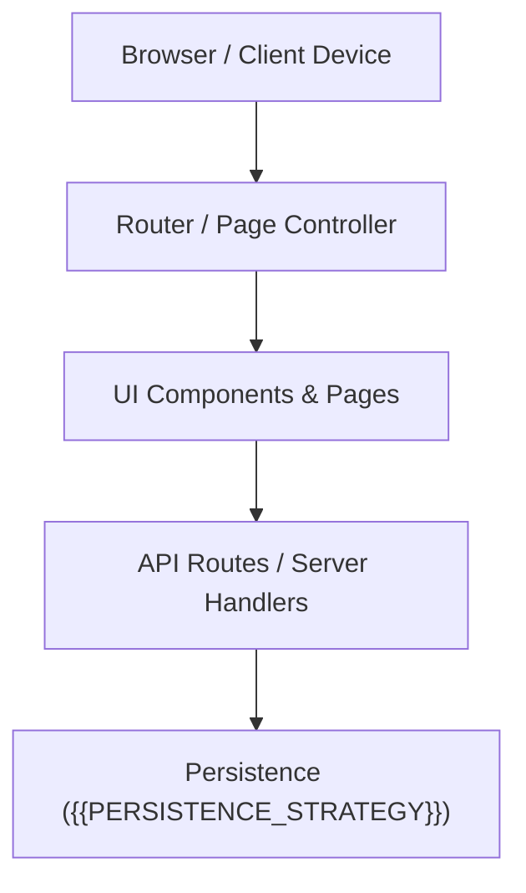

# Web Application Architecture — {{PROJECT_NAME}}

> {{PROJECT_MISSION}}

This document outlines the high-level architecture, system boundaries, and request-response flow for the {{PROJECT_NAME}} web application.

---

## 1. System Overview

{{PROJECT_NAME}} is an MVP web application engineered for simplicity, responsiveness, and fast iteration using {{FRAMEWORK_OR_PLATFORM}}.

---

## 2. Technology Stack

| Layer | Technology Choice | Description |
|---|---|---|
| **Core Language** | `{{PRIMARY_LANGUAGE}}` | Primary language for application logic and components |
| **Framework / UI** | `{{FRAMEWORK_OR_PLATFORM}}` | Web routing, layout rendering, and component lifecycle |
| **Persistence** | `{{PERSISTENCE_STRATEGY}}` | Database or storage engine for application state |
| **Styling** | Modern CSS / Design Tokens | Responsive, lightweight UI styles |

---

## 3. Key Design Principles

1. **Keep It Simple (KISS)**: Prioritize clean, idiomatic framework code over premature abstraction.
2. **Deterministic State**: State mutations occur through explicit form actions, API routes, or state handlers.
3. **Graceful Degeneracy**: Form errors, network timeouts, and missing data present actionable feedback to the user.
4. **Fast First Paint**: Minimize heavy runtime dependencies to keep bundle sizes lean.
