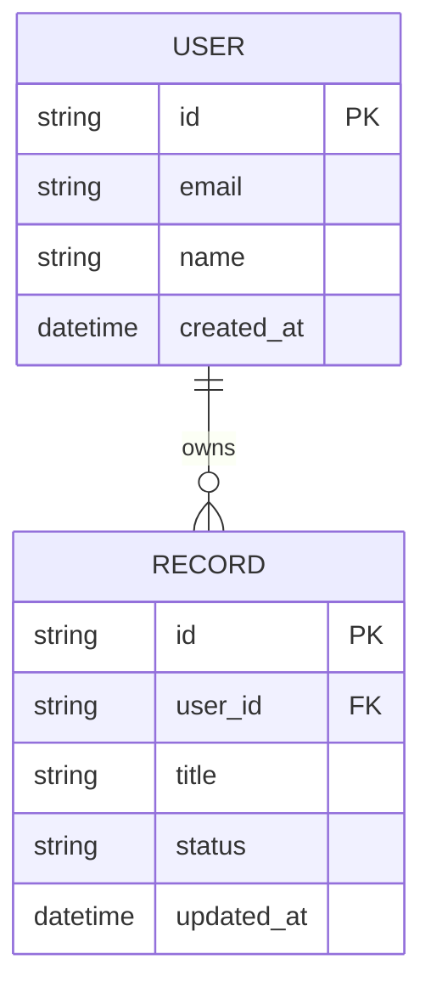

# Data Schema & Persistence Guide — {{PROJECT_NAME}}

> Persistence model, data entities, and storage operations for {{PROJECT_NAME}}.

---

## 1. Persistence Strategy Overview

The application stores records using **`{{PERSISTENCE_STRATEGY}}`**.

### Storage Requirements
- Lightweight initialization with zero or minimal operational overhead.
- Deterministic migrations or schema synchronization.
- Transactional integrity for user write operations.

---

## 2. Core Entities

### Entity Definitions

#### 1. Users (`users`)
- `id` (String / UUID, Primary Key): Unique account identifier.
- `email` (String, Unique): User email address.
- `created_at` (DateTime): Account registration timestamp.

#### 2. Project Records (`records`)
- `id` (String / UUID, Primary Key): Unique record identifier.
- `user_id` (String, Foreign Key): Owning user identifier.
- `title` (String): Display title or description of the entry.
- `status` (String): Current workflow status (e.g. `pending`, `active`, `archived`).
- `updated_at` (DateTime): Timestamp of last modification.

---

## 3. Data Safety and Backups

1. **Local Development**: Store development database file locally (exclude from git via `.gitignore`).
2. **Backups**: Configure automated snapshots or regular exports of `{{PERSISTENCE_STRATEGY}}`.
3. **Validation**: Enforce schema constraints at the application layer before writing data.
