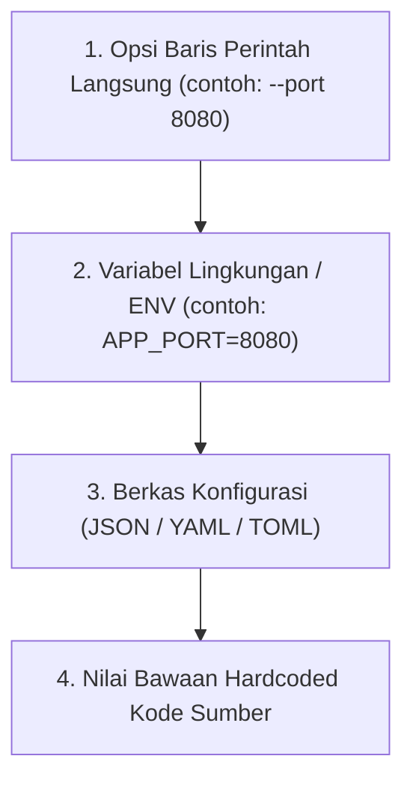

# Spesifikasi Antarmuka CLI, Opsi & Argumen — {{PROJECT_NAME}}

> Spesifikasi kanonikal untuk sintaks baris perintah, konvensi pemilahan argumen (*argument parsing*), subperintah, prioritas konfigurasi, dan UX interaktif.

---

## 1. Matriks Sintaks & Eksekusi Perintah

- **Nama Proyek:** `{{PROJECT_NAME}}`
- **Biner Utama / Alias Perintah:** `{{COMMAND_NAME}}`
- **Bahasa Implementasi / Runtime:** `{{CLI_LANGUAGE}}`
- **Model Eksekusi Utama:** `{{RUN_MODE}}`
- **Tujuan Output Log:** `{{LOG_OUTPUT_TARGET}}`

### Sintaks Pemanggilan Standar:
```bash
{{COMMAND_NAME}} [OPSI_GLOBAL] [SUBPERINTAH] [OPSI_SUBPERINTAH] [ARGUMEN...]
```

---

## 2. Opsi Global Standar & Konvensi POSIX

Setiap perkakas CLI wajib mendukung opsi standar yang kompatibel dengan POSIX berikut:

| Opsi (Pendek / Panjang) | Tipe | Nilai Awal | Deskripsi |
| :--- | :--- | :--- | :--- |
| `-h, --help` | Boolean | `false` | Tampilkan petunjuk penggunaan, subperintah, daftar opsi, dan contoh, lalu keluar dengan status `0`. |
| `-V, --version` | Boolean | `false` | Tampilkan nama perkakas, versi semantik, dan hash commit, lalu keluar dengan status `0`. |
| `-v, --verbose` | Boolean | `false` | Aktifkan pencatatan log operasional dan debug mendalam ke stderr. |
| `-q, --quiet` | Boolean | `false` | Redam output yang tidak esensial; hanya cetak pesan kesalahan dan data yang diminta. |
| `-n, --dry-run` | Boolean | `false` | Simulasikan eksekusi, periksa masukan, dan cetak rencana perubahan tanpa efek samping nyata. |
| `--config <path>` | String | `~/.config/{{COMMAND_NAME}}/config.json` | Jalur ke berkas konfigurasi eksplisit. |
| `--format <json\|yaml\|table>` | String | `table` | Format tampilan stdout yang ramah mesin (JSON/YAML) atau mudah dibaca manusia (Tabel). |

---

## 3. Hierarki Konfigurasi (Urutan Prioritas)

Ketika memuat pengaturan, konfigurasi diurai dalam urutan bertingkat yang ketat (prioritas tertinggi menang):



1. **Argumen CLI:** Flag yang dikirim langsung di terminal selalu mengesampingkan sumber lain.
2. **Variabel Lingkungan (ENV):** Memiliki prefiks huruf kapital dari nama perintah (contoh: `{{COMMAND_NAME}}_CONFIG_PATH`).
3. **Konfigurasi Lokal Proyek:** `./.{{COMMAND_NAME}}rc` pada direktori kerja aktif.
4. **Konfigurasi Pengguna (Home):** `~/.config/{{COMMAND_NAME}}/config.json`.
5. **Nilai Bawaan Sistem:** Nilai aman yang tertanam langsung di dalam kode aplikasi.

---

## 4. Pengelompokan Subperintah

Jika `{{COMMAND_NAME}}` menyediakan berbagai alur kerja operasional, kelompokkan ke dalam subperintah kata benda-kata kerja yang deskriptif:

```bash
# Contoh Struktur Subperintah
{{COMMAND_NAME}} run [opsi]          # Jalankan siklus otomasi utama
{{COMMAND_NAME}} ingest <sumber>     # Lakukan proses ingestion data mentah
{{COMMAND_NAME}} status              # Cek kesehatan proses dan progres antrean
{{COMMAND_NAME}} config show         # Tampilkan konfigurasi aktif
```
