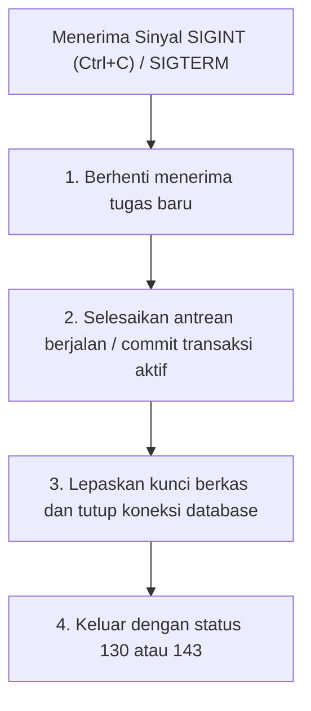

# Siklus Hidup Proses, Stream & Exit Code — {{PROJECT_NAME}}

> Spesifikasi teknis pemisahan stream standar UNIX, penentuan exit code proses, penanganan sinyal POSIX, dan penghentian proses secara elegan (*graceful shutdown*).

---

## 1. Pemisahan Stream Standar (Filosofi UNIX)

Untuk memungkinkan penggabungan dengan pipeline shell (`|`, `xargs`, `jq`), `{{COMMAND_NAME}}` memisahkan data keluaran secara ketat dari pesan log:

- **`stdout` (Output Standar):** Dikhususkan hanya untuk hasil kueri atau keluaran transformasi data. Saat dialirkan (*piped*), hanya data terformat (seperti raw JSON atau CSV) yang ditulis.
- **`stderr` (Error Standar):** Dikhususkan untuk bilah progres (*progress bar*), spanduk informasi, pesan diagnostik, peringatan, dan error.
- **`stdin` (Input Standar):** Saat dipanggil tanpa argumen berkas atau menggunakan tanda `-` sebagai jalur, baca aliran data secara berurutan.

```bash
# Contoh pipeline komposable
{{COMMAND_NAME}} ingest - < input.json | jq '.processed_ids'
```

---

## 2. Standar Exit Code Proses

Setiap eksekusi wajib mengakhiri proses dengan exit code deterministik:

| Kode | Arti | Contoh Pemicu |
| :---: | :--- | :--- |
| `0` | **Sukses** | Tugas selesai tanpa kesalahan. |
| `1` | **Kesalahan Eksekusi Umum** | Timeout jaringan, penolakan tulis basis data, pengecualian tak tertangani. |
| `2` | **Penyalahgunaan Sintaks Shell** | Opsi wajib belum diisi, argumen tidak dikenal, tipe data opsi salah. |
| `3` | **Kegagalan Validasi Data** | Muatan data gagal uji skema; rekaman masuk karantina. |
| `126` | **Perintah Tidak Dapat Dieksekusi** | Izin berkas eksekusi ditolak (*permission denied*). |
| `127` | **Perintah Tidak Ditemukan** | Dependensi biner tidak ditemukan pada jalur `$PATH`. |
| `130` | **Dihentikan oleh Pengguna (`SIGINT`)** | Pengguna menekan Ctrl+C; pembatalan elegan berhasil dieksekusi. |
| `143` | **Dihentikan oleh Supervisor (`SIGTERM`)** | Kontainer atau systemd meminta penghentian layanan secara tertib. |

---

## 3. Penanganan Sinyal & Penghentian Elegan

Perkakas otomasi dan daemon dilarang berhenti mendadak saat sedang menulis data atau di tengah transaksi:



- **Batas Waktu Tenggang (*Grace Period*):** Berikan waktu hingga 10 detik agar tugas yang sedang berjalan dapat selesai.
- **Penghentian Paksa (`SIGKILL` / dua kali Ctrl+C):** Jika pengguna menekan Ctrl+C kedua kalinya selama masa tenggang, batalkan proses seketika dengan status `130`.

---

## 4. Idempotensi & Percobaan Ulang Aman

Seluruh operasi CLI yang memodifikasi sistem eksternal (basis data, API, sistem berkas) wajib bersifat idempoten:
- Menjalankan perintah yang sama persis berulang kali dengan masukan identik harus menghasilkan status akhir yang sama persis tanpa menduplikasi rekaman.
- Gunakan kunci idempotensi unik (misalnya hash SHA-256 dari muatan rekaman) saat mengirim permintaan ke layanan hulu.
