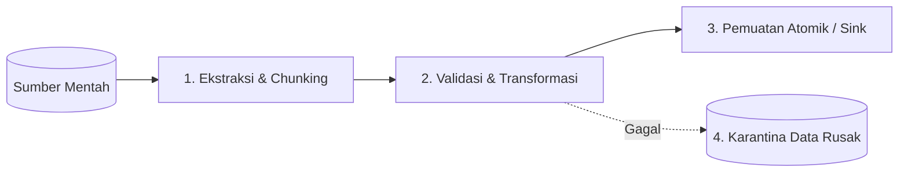

# Spesifikasi Batch Ingestion & Pipeline Data — {{PROJECT_NAME}}

> Spesifikasi arsitektur pemrosesan kumpulan data batch, batasan streaming memori, penanganan tekanan balik (*backpressure*), dan karantina galat.

---

## 1. Tahapan Pipeline & Siklus Pemrosesan

Pipeline data yang dijalankan oleh `{{COMMAND_NAME}}` mengikuti model pemrosesan empat tahap yang terstandarisasi:

1. **Ekstraksi & Pemotongan (*Chunking*):** Alirkan berkas masukan atau rekaman API dalam potongan terukur (standar: 500 rekaman per potongan) untuk membatasi konsumsi memori.
2. **Validasi & Transformasi:** Validasi skema rekaman yang masuk. Format data ke dalam model tujuan yang telah dinormalisasi.
3. **Pemuatan Atomik (*Atomic Load*):** Muat data ke dalam penyimpanan target dalam transaksi basis data atau muatan API massal.
4. **Karantina Data (*Dead-Letter*):** Pisahkan seketika rekaman yang cacat atau ditolak tanpa menghentikan pemrosesan rekaman lain yang valid.

---

## 2. Batas Memori & Keamanan Streaming

Untuk mencegah kegagalan sistem fatal akibat kehabisan memori (*Out-Of-Memory / OOM*):
- **Dilarang Membaca Berkas Utuh Sekaligus:** Hindari penggunaan fungsi seperti `fs.readFileSync()` atau membaca seluruh baris berkas berukuran gigabita ke dalam larik memori tunggal.
- **Mekanisme Tekanan Balik (*Backpressure*):** Jeda stream pembaca jika antrean pekerja pemrosesan hilir telah mencapai kapasitas konkurensi maksimal.
- **Batas Alokasi Memori (RSS):** Tetapkan ambang batas memori tertinggi (contoh: maksimal penggunaan 512 MB).

---

## 3. Protokol Penanganan Galat & Karantina

Ketika sebuah rekaman data gagal dalam proses transformasi atau penyimpanan:
1. **Dilarang Menghilangkan Data Tanpa Jejak:** Catat log peringatan eksplisit ke `stderr` yang mencantumkan nomor baris atau pengenal unik rekaman.
2. **Direktori Karantina (Dead-Letter):** Simpan data rekaman yang gagal beserta alasan penolakannya ke `./quarantine/<timestamp>-<job_id>.jsonl`.
3. **Batas Toleransi Kegagalan:** Jika lebih dari 5% total rekaman gagal dalam validasi skema, batalkan seluruh batch dan lakukan rollback pada transaksi yang sedang terbuka.
