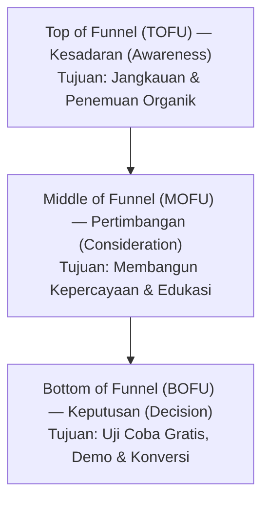

# Kalender Konten & Tema Editorial — {{PROJECT_NAME}}

> Spesifikasi kanonikal untuk irama jadwal editorial, pilar konten, pemetaan funnel audiens, dan siklus hidup produksi konten.

---

## 1. Misi Konten & Pilar Strategis

- **Nama Proyek:** `{{PROJECT_NAME}}`
- **Tone of Voice Merek:** `{{BRAND_TONE}}`
- **Pilar Konten Utama:** `{{CONTENT_PILLARS}}`
- **Kanal Distribusi Utama:** `{{PRIMARY_CHANNELS}}`

### Rincian Pilar Strategis:
1. **Pilar 1 (Wawasan Industri & Tren):** Membangun kepemimpinan pemikiran (*thought leadership*) dan mengedukasi pasar mengenai tantangan industri terkini.
2. **Pilar 2 (Panduan Praktis & Playbook):** Tutorial teknis atau panduan operasional langkah demi langkah yang memberikan kegunaan langsung.
3. **Pilar 3 (Studi Kasus & Transformasi):** Bukti konkret hasil sebelum dan sesudah serta keberhasilan pengguna dalam menyelesaikan masalah.
4. **Pilar 4 (Ulasan Fitur & Solusi Produk):** Mendemonstrasikan bagaimana `{{PROJECT_NAME}}` menyelesaikan hambatan operasional spesifik.

---

## 2. Pemetaan Funnel Audiens

Setiap materi konten wajib memiliki peruntukan tahapan yang jelas dalam perjalanan konversi audiens:

| Tahap Funnel | Tipe Konten Utama | Metrik Utama | Ajakan Bertindak (CTA) |
| :--- | :--- | :--- | :--- |
| **TOFU (Kesadaran)** | Artikel SEO, thread media sosial, video ringkas | Impresi, pageview, share | Ikuti / Simpan / Baca Selengkapnya |
| **MOFU (Pertimbangan)** | Playbook mendalam, perbandingan solusi, buletin email | Pelanggan baru, waktu baca di halaman | Berlangganan Buletin / Unduh Panduan |
| **BOFU (Keputusan)** | Studi kasus pelanggan, panduan fitur produk, kalkulator ROI | Pendaftaran akun, permintaan demo | Mulai Uji Coba / Hubungi Tim Sales |

---

## 3. Siklus Hidup Produksi Editorial

Seluruh konten diproses melalui enam tahapan terstandarisasi:

1. **Penggalian Ide & Penilaian:** Usulkan topik sesuai pilar konten dan volume pencarian kata kunci; validasi pada backlog editorial.
2. **Riset & Kerangka Tulisan:** Tentukan sudut pandang (*angle*), niat pencarian, statistik pendukung, dan hierarki judul (`H1`, `H2`, `H3`).
3. **Penyusunan Draf:** Tulis konten dengan mematuhi panduan `{{BRAND_TONE}}` dan standar keterbacaan.
4. **Tinjauan Editorial & Cek Fakta:** Verifikasi keakuratan fakta, tautan sumber, dan kesesuaian nada bahasa.
5. **Publikasi & Optimasi On-Page:** Format di CMS, optimalkan meta tag, tentukan tautan kanonikal, dan cek tampilan seluler.
6. **Distribusi & Amplifikasi:** Jalankan sindikasi ke berbagai kanal dan tanggapi komentar audiens.

---

## 4. Jadwal Kalender Editorial

| Irama Jadwal | Jenis Deliverable | Kanal Publikasi | Penanggung Jawab |
| :--- | :--- | :--- | :--- |
| **Mingguan (Selasa)** | 1x Artikel Panjang Mendalam (1.500+ kata) | Blog Resmi / Website | Penulis Konten |
| **Mingguan (Kamis)** | 1x Buletin Editorial Terkurasi | Saluran Email Newsletter | Editor Konten |
| **Harian (Senin–Jumat)** | 2x Konten Ringkas / Utas Media Sosial | Media Sosial Resmi | Spesialis Media Sosial |
| **Bulanan** | 1x Riset Tolok Ukur / Whitepaper | Pustaka Sumber Daya | Pemimpin Riset & Pertumbuhan |
