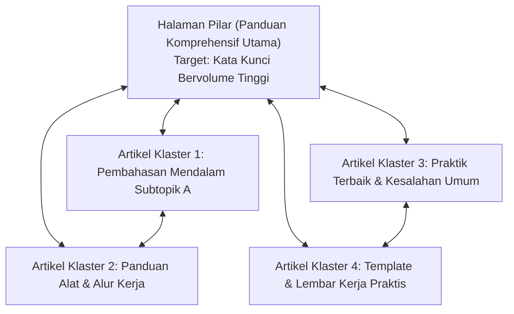

# Strategi Kata Kunci SEO & Klaster Topik — {{PROJECT_NAME}}

> Spesifikasi teknis untuk optimasi pencarian organik, pemetaan niat pencarian (*search intent*), penautan internal klaster topik, dan daftar periksa on-page.

---

## 1. Matriks Kata Kunci Target & Niat Pencarian

- **Klaster Kata Kunci Utama:** `{{TARGET_KEYWORDS}}`
- **Fokus Niat Pencarian:** Informasional (Panduan Praktis / Konseptual) dan Komersial (Perbandingan / Evaluasi Solusi).

| Klaster Kata Kunci Target | Niat Pencarian | Tingkat Volume Bulanan | Kesulitan | URL Halaman Target |
| :--- | :--- | :---: | :---: | :--- |
| `{{TARGET_KEYWORDS}}` (Utama) | Komersial / Transaksional | Tinggi | Sedang/Tinggi | `/solusi/{{PROJECT_NAME}}` |
| "Cara mengoptimalkan [topik]" | Informasional | Sedang | Rendah/Sedang | `/blog/panduan-lengkap` |
| "Aplikasi terbaik untuk [topik]" | Investigasi Komersial | Sedang | Sedang | `/blog/perbandingan-aplikasi` |
| "Template / format [topik]" | Utilitas Informasional | Tinggi | Rendah | `/sumber-daya/template-gratis` |

---

## 2. Arsitektur Klaster Topik (Hub & Spoke)

Kelompokkan konten terkait ke dalam klaster topik yang saling memperkuat dengan halaman pilar (*pillar page*) sebagai poros utama:

- **Aturan Tautan:** Setiap artikel klaster wajib menautkan kembali ke halaman pilar menggunakan teks tautan (*anchor text*) yang kaya kata kunci deskriptif.
- **Tautan Silang:** Artikel klaster yang membahas konsep berdampingan wajib saling menautkan langsung untuk memperkuat otoritas topik.

---

## 3. Daftar Periksa Teknis SEO On-Page

Setiap konten digital yang dipublikasikan ke situs web wajib memenuhi daftar periksa berikut:

| Item Pengecekan | Persyaratan Standar | Metode Verifikasi |
| :--- | :--- | :--- |
| **Tag Judul (Title Tag)** | Maksimal 60 karakter, kata kunci utama di paruh awal | Periksa elemen `<title>` HTML |
| **Deskripsi Meta** | 140–155 karakter, memuat manfaat jelas dan CTA | Periksa `<meta name="description">` |
| **Tag H1** | Tepat satu tag `<h1>` per halaman, sesuai niat pencarian | Audit struktur DOM |
| **Hierarki Judul Semantik** | Urutan bersarang yang rapi (`H1` -> `H2` -> `H3`), tanpa lompatan level | Audit heading halaman |
| **Slug URL** | Ringkas, huruf kecil, dipisahkan tanda hubung, fokus kata kunci | Bilah alamat peramban |
| **Alt Text Gambar** | Teks alternatif deskriptif untuk setiap gambar informatif | Periksa `` |
| **Data Terstruktur (Schema)** | Skema JSON-LD `Article` atau `FAQPage` valid | Uji Hasil Kaya Google |
| **Tautan Internal & Eksternal** | 2–4 tautan ke halaman internal relevan, 1–2 tautan kredibel keluar | Pemindaian tautan halaman |
