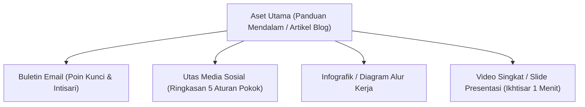

# Distribusi Multi-Kanal & Daur Ulang Konten — {{PROJECT_NAME}}

> Protokol operasional untuk sindikasi konten, alur daur ulang (*repurposing*) lintas kanal, irama publikasi, dan evaluasi analitik performa.

---

## 1. Alur Daur Ulang Konten (Satu Aset ke Banyak Format)

Setiap aset konten panjang utama dipecah secara terstruktur ke dalam berbagai format media sosial dan komunikasi publik:

### Panduan Transformasi:
1. **Panduan Inti:** Artikel mendalam 1.500 kata yang dipublikasikan pada URL resmi situs web.
2. **Adaptasi Buletin:** Intisari ringkas 400 kata yang dikirim ke pelanggan buletin disertai tautan ke panduan lengkap.
3. **Utas / Karosel Media Sosial:** Format visual 5–7 slide yang menyoroti perbandingan konsep atau lembar kerja praktis.
4. **Sindikasi Komunitas:** Jawaban terkurasi yang membagikan solusi pada forum diskusi profesional yang relevan.

---

## 2. Matriks Kanal & Irama Publikasi

- **Kanal Distribusi Utama:** `{{PRIMARY_CHANNELS}}`

| Kanal Distribusi | Format Konten Bawaan | Frekuensi Optimal | Tujuan Utama |
| :--- | :--- | :--- | :--- |
| **Blog Resmi Situs** | Artikel komprehensif format markdown | 1x / minggu | Otoritas pencarian organik, rujukan jangka panjang |
| **Buletin Email** | Rangkuman bacaan terkurasi | 1x / minggu | Retensi audiens, lalu lintas rujukan langsung |
| **Jejaring Profesional (LinkedIn)** | Karosel dokumen, postingan teks wawasan | 3x / minggu | Menjangkau pengambil keputusan B2B, relasi kemitraan |
| **Pembaruan Singkat (X)** | Utas panduan ringkas, cuplikan kode/tips | Setiap hari kerja | Interaksi komunitas langsung, tanggapan produk |

---

## 3. Evaluasi & Pelacakan Indikator Kinerja (KPI)

Evaluasi efektivitas distribusi konten menggunakan matriks pelaporan terstandarisasi berikut:

| Kategori KPI | Pengenal Metrik | Frekuensi Pengukuran | Tolok Ukur Kesehatan |
| :--- | :--- | :--- | :--- |
| **Jangkauan & Penemuan** | Pengunjung Unik Organik | Mingguan | Pertumbuhan +10% MoM |
| **Interaksi (Engagement)** | Rata-rata Waktu di Halaman / Scroll Depth | Mingguan | > 2,5 menit, 60% gulir halaman |
| **Konversi Audiens** | Rasio Pendaftaran Buletin | Bulanan | > 2,5% dari total pengunjung blog |
| **Dampak Pipeline** | Registrasi Produk dari Konten | Bulanan | Terkuantifikasi pada CRM |
