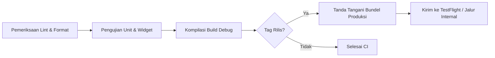

# Kompilasi Build, Code Signing & Distribusi — {{PROJECT_NAME}}

> Spesifikasi teknis untuk penandatanganan kode kriptografis, alur kerja CI/CD otomatis, jalur distribusi pengujian beta, dan penomoran versi rilis.

---

## 1. Manajemen Kunci & Penandatanganan Kode (Code Signing)

Dilarang keras melakukan commit kunci privat, keystore, atau sertifikat penandatanganan ke repositori Git. Simpan seluruh rahasia di brankas CI terenkripsi atau *secret manager* yang aman.

### 1.1. Penandatanganan iOS (Apple Developer)
- **Sertifikat:** Apple Distribution Certificate untuk build produksi, Apple Development untuk pengujian debug.
- **Profil Penyediaan (Provisioning Profiles):** Profil App Store Distribution yang terikat pada `{{APP_BUNDLE_ID}}`.
- **Manajemen Otomatis:** Gunakan Fastlane Match melalui repositori Git terenkripsi atau kunci API App Store Connect.

### 1.2. Penandatanganan Android (Google Play)
- **Kunci Unggah (Upload Key):** Buat keystore PKCS12 / JKS untuk unggahan lokal dan pipeline CI.
  ```bash
  keytool -genkey -v -keystore release-upload.jks -alias upload -keyalg RSA -keysize 2048 -validity 10000
  ```
- **Play App Signing:** Google Play mengelola kunci rilis akhir yang dioptimalkan per perangkat. Pengembang mengunggah bundel `.aab` (*Android App Bundle*) terenkripsi.
- **Variabel Lingkungan CI:** `ANDROID_KEYSTORE_BASE64`, `ANDROID_KEYSTORE_PASSWORD`, `ANDROID_KEY_ALIAS`, `ANDROID_KEY_PASSWORD`.

---

## 2. Alur Kerja Otomasi Build (CI/CD)

Setiap *pull request* dan tag rilis memicu validasi otomatis:



### Perintah Kompilasi:
- **Android App Bundle:**
  ```bash
  # Flutter
  flutter build appbundle --release --obfuscate --split-debug-info=./build/symbols
  # React Native / Gradle
  ./android/gradlew bundleRelease
  ```
- **iOS Archive & IPA:**
  ```bash
  # Eksekusi Fastlane
  bundle exec fastlane ios build_and_upload
  ```

---

## 3. Jalur Distribusi & Tahapan Peluncuran

1. **Pengembangan Internal (Harian):** Build otomatis dibagikan kepada anggota tim inti melalui Firebase App Distribution atau instalasi lokal langsung.
2. **Pengujian Beta (Mingguan):** Disebarkan ke Apple TestFlight (Grup Internal & Eksternal) dan Jalur Pengujian Tertutup (*Closed Testing*) Google Play.
3. **Peluncuran Bertahap ke Produksi (*Staged Rollout*):**
   - Hari ke-1: 5% dari total pengguna
   - Hari ke-2: 10% dari total pengguna
   - Hari ke-3: 20% dari total pengguna
   - Hari ke-5: 50% dari total pengguna
   - Hari ke-7: 100% rilis penuh
   - *Pemicu Penghentian Darurat:* Jika tingkat crash melebihi 0,2%, hentikan peluncuran bertahap seketika.

---

## 4. Konvensi Penomoran Versi (Versioning)

Terapkan *Semantic Versioning* yang dipadukan dengan nomor build yang bertambah secara berurutan (*monotonically increasing*):
- **Format:** `MAJOR.MINOR.PATCH+BUILD_NUMBER` (contoh: `1.2.0+142`)
- **Nama Versi (`1.2.0`):** Terlihat oleh pengguna akhir pada halaman toko aplikasi.
- **Nomor Build (`142`):** Bilangan bulat yang bertambah di setiap kompilasi artefak; wajib unik untuk setiap pengajuan ke toko aplikasi.
