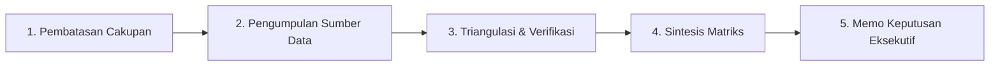

# Metodologi Riset & Kerangka Cakupan — {{PROJECT_NAME}}

> Spesifikasi kanonikal untuk perumusan masalah riset, hipotesis investigasi, desain metodologi, dan batasan ruang lingkup kajian.

---

## 1. Tujuan Riset & Topik Utama

- **Nama Proyek:** `{{PROJECT_NAME}}`
- **Topik Riset Utama:** `{{RESEARCH_TOPIC}}`
- **Metodologi Utama:** `{{RESEARCH_METHODOLOGY}}`
- **Target Pembaca Eksekutif:** `{{EXECUTIVE_AUDIENCE}}`

### Pertanyaan Riset Utama (CRQ):
1. **CRQ 1 (Kondisi Pasar & Masalah):** Apa saja kondisi struktural, titik nyeri (*pain points*), dan solusi yang saat ini ada dalam domain ini?
2. **CRQ 2 (Diferensiasi Perbandingan):** Bagaimana kinerja alternatif pendekatan atau kompetitor jika diukur terhadap kriteria evaluasi utama?
3. **CRQ 3 (Rekomendasi Strategis):** Langkah strategis apa yang didukung bukti kuat yang harus diambil oleh `{{EXECUTIVE_AUDIENCE}}` untuk hasil optimal?

---

## 2. Hipotesis Investigasi & Gerbang Validasi

Rumuskan hipotesis yang dapat diuji sebelum pengumpulan data untuk menghindari bias konfirmasi:

| ID Hipotesis | Pernyataan Hipotesis | Kriteria Bukti Pembuktian | Hasil Validasi |
| :--- | :--- | :--- | :---: |
| **H-01** | Kendala utama pengguna adalah kelambanan operasional (*latency*), bukan ketiadaan fitur. | > 60% responden wawancara menempatkan waktu penyelesaian sebagai frustrasi utama. | [ ] |
| **H-02** | Solusi pasar yang ada saat ini membebani biaya tinggi dan kurva belajar yang curam. | Data tolok ukur harga langganan publik dan waktu onboarding pengguna. | [ ] |
| **H-03** | Penerapan framework terstandarisasi mengurangi galat implementasi lebih dari 40%. | Perbandingan uji empiris atau metrik studi kasus historis. | [ ] |

---

## 3. Batasan Cakupan & Delimitasi

Untuk menjaga kedalaman analisis yang ketat dan mencegah pelebaran cakupan (*scope creep*):

### Dalam Cakupan (In Scope):
- Analisis terhadap pelaku pasar tervalidasi dan laporan publik dalam kurun waktu 24 bulan terakhir.
- Wawancara langsung dengan praktisi lapangan dan kumpulan data survei kuantitatif terstruktur.
- Kompromi ekonomi dan operasional yang relevan bagi `{{EXECUTIVE_AUDIENCE}}`.

### Di Luar Cakupan (Out of Scope):
- Proyeksi makro-ekonomi spekulatif yang melampaui rentang waktu 3 tahun ke depan.
- Klaim anekdotal tanpa verifikasi atau rumor blog tanpa sumber rujukan yang jelas.
- Eksekusi teknis langsung atas rekomendasi (diatur di bawah modul harness operasional terpisah).

---

## 4. Siklus Tata Kelola Riset

