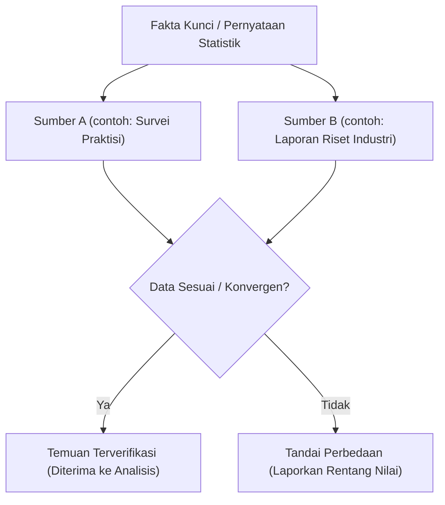

# Pengumpulan Data, Sumber Rujukan & Verifikasi — {{PROJECT_NAME}}

> Spesifikasi teknis untuk tingkatan kredibilitas sumber rujukan, triangulasi bukti, standar sitasi, dan integritas data.

---

## 1. Hierarki Kredibilitas Sumber Rujukan

Seluruh temuan dan pernyataan strategis wajib terhubung langsung ke sumber rujukan terverifikasi dalam hierarki evaluasi berikut:

- **Sumber Primer Utama:** `{{PRIMARY_SOURCES}}`

| Tingkat Sumber | Peringkat Kredibilitas | Jenis Sumber yang Diterima | Aturan Penggunaan |
| :--- | :---: | :--- | :--- |
| **Tingkat 1 (Otoritatif)** | Standar Emas | Wawancara pemangku kepentingan langsung, laporan keuangan teraudit, basis data resmi regulator, makalah akademis peer-reviewed. | Diterima sebagai kebenaran sumber tunggal jika metodologi terverifikasi. |
| **Tingkat 2 (Industri / Pakar)** | Tinggi | Laporan riset analis industri terkemuka (Gartner, Forrester), data tolok ukur teruji, dokumentasi teknis resmi vendor. | Wajib divalidasi silang terhadap setidaknya satu laporan independen lain. |
| **Tingkat 3 (Observasional)** | Pendukung | Media teknologi bereputasi, blog industri ternama, rangkuman studi kasus, survei komunitas. | Hanya sebagai latar belakang kontekstual; tidak boleh menjadi dasar tunggal klaim strategis. |
| **Tingkat 4 (Tidak Terverifikasi)** | Dilarang | Utas forum anonim, postingan media sosial spekulatif, siaran pers tanpa sumber data. | Dilarang keras dimasukkan ke dalam temuan analisis. |

---

## 2. Protokol Triangulasi Bukti & Cek Fakta

Setiap klaim faktual penting (ukuran pasar, rasio kesalahan, angka finansial) wajib melalui **Triangulasi Sumber Ganda**:

---

## 3. Standar Sitasi & Asal-Usul Data (Provenance)

Setiap catatan data dalam dokumen riset wajib mencantumkan informasi rujukan yang lengkap:

- **Format:** `[Nama Sumber] (Penulis / Lembaga, Tanggal Publikasi). Judul Karya. URL / DOI (Diarsipkan: YYYY-MM-DD).`
- **Contoh:** `[Kemenkeu RI] (Ditjen Pajak, 2025-02-10). Laporan Kepatuhan Fiskal. https://pajak.go.id/... (Diarsipkan: 2026-01-15).`

---

## 4. Anonimisasi & Kerahasiaan Responden

Ketika menyelenggarakan wawancara kualitatif dengan pengguna atau pelaku industri:
- Lindungi privasi narasumber dengan menyamarkan nama asli dan merek dagang (contoh: sebut sebagai "Narasumber A, VP Engineering Perusahaan Fintech Tier-1").
- Simpan transkrip mentah yang belum disensor pada direktori dengan akses terbatas dan tidak diunggah ke repositori publik.
