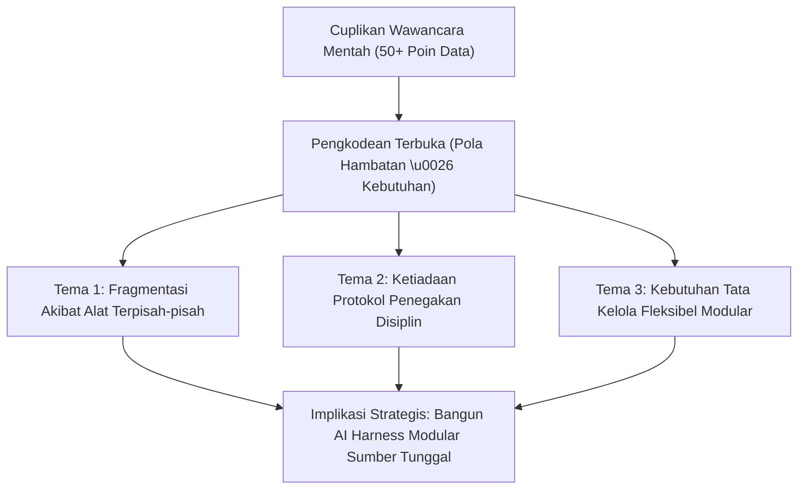

# Kerangka Analisis & Sintesis Tolok Ukur — {{PROJECT_NAME}}

> Model analitis untuk penataan data terstruktur, perbandingan fitur kompetitor, pengkodean pola kualitatif, dan sintesis strategis.

---

## 1. Matriks Perbandingan Fitur Kompetitor

Evaluasi opsi yang ada di pasar atau solusi alternatif terhadap kapabilitas ternormalisasi:

| Dimensi Evaluasi | Bobot | Solusi A (Pemain Lama) | Solusi B (Open Source) | Pendekatan {{PROJECT_NAME}} | Bukti Sitasi |
| :--- | :---: | :---: | :---: | :---: | :--- |
| **Waktu Penyiapan (Time-to-Value)** | 25% | Lambat (2–4 minggu) | Sedang (3–5 hari) | Sangat Cepat (< 1 jam) | Log pengujian tolok ukur #04 |
| **Beban Operasional Tim** | 25% | Tinggi (Butuh admin khusus) | Sedang (Konfigurasi manual) | Rendah (Otomasi CLI terpadu) | Wawancara pengguna #02, #07 |
| **Keluasan Kustomisasi** | 20% | Kaku (Keterikatan vendor) | Tinggi (Akses kode penuh) | Tinggi (Arsitektur template modular) | Audit arsitektur repositori |
| **Biaya Lisensi** | 20% | Mahal (Langganan tahunan) | Gratis (Hosting mandiri) | Gratis / Standar Terbuka | Daftar harga publik vendor |
| **Kualitas Dokumentasi** | 10% | Terpecah-pecah | Bergantung pada wiki publik | Standar Kanonikal Resmi | Audit kelengkapan dokumen |

---

## 2. Pengkodean Pola Kualitatif & Sintesis

Kelompokkan transkrip wawancara kualitatif dan catatan observasi ke dalam tema analitis berulang:

---

## 3. Matriks Hubungan Temuan ke Implikasi Strategis

Setiap temuan yang diajukan kepada jajaran kepemimpinan wajib menghubungkan fakta empiris langsung ke tindakan strategis nyata:

| Pengamatan Inti (Fakta Lapangan) | Bukti Empiris (Data Pendukung) | Implikasi Strategis (Makna Bagi {{PROJECT_NAME}}) |
| :--- | :--- | :--- |
| **Pengamatan 1:** Tim menghabiskan 30% waktu sprint awal untuk merapikan setup proyek yang tidak konsisten. | Data tiket orientasi pada 12 tim produk selama 6 bulan terakhir. | Sediakan generator scaffolding CLI instan bebas dependensi dengan tata kelola siap pakai. |
| **Pengamatan 2:** Template monolitik terasa terlalu berat untuk proyek ringkas (seperti landing page atau skrip otomasi). | 78% narasumber mengaku menghapus hingga 80% berkas template bawaan lama. | Pisahkan template ke dalam modul-modul terfokus yang berbagi modul inti bersama. |
| **Pengamatan 3:** Tim multibahasa memerlukan sinkronisasi mutlak antara dokumen bahasa Indonesia dan Inggris. | Masukan dari divisi rekayasa lintas wilayah. | Wajibkan uji paritas struktural dan konseptual otomatis 100% pada pipeline validasi. |
