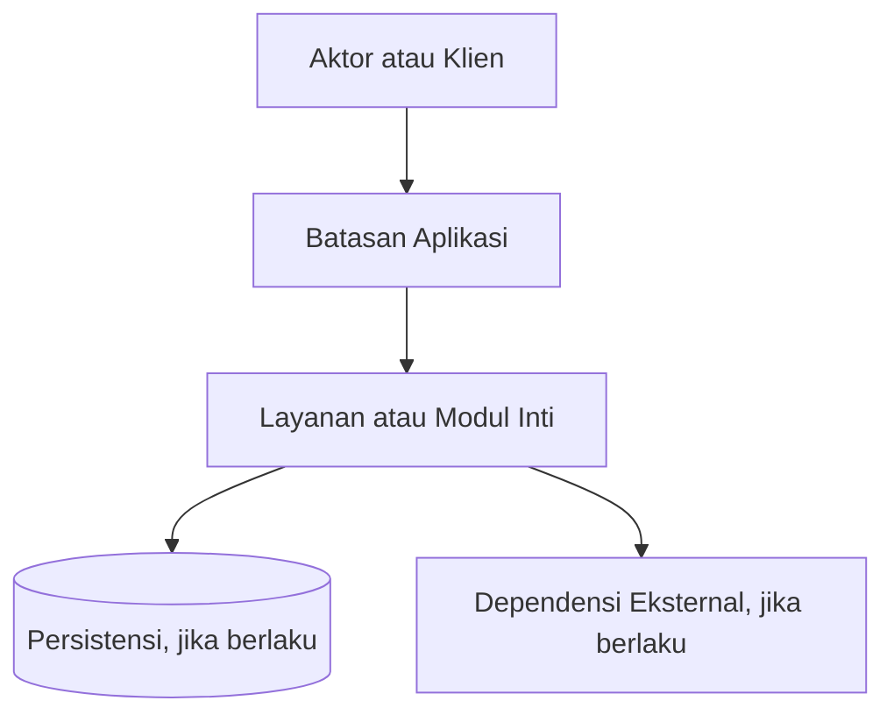
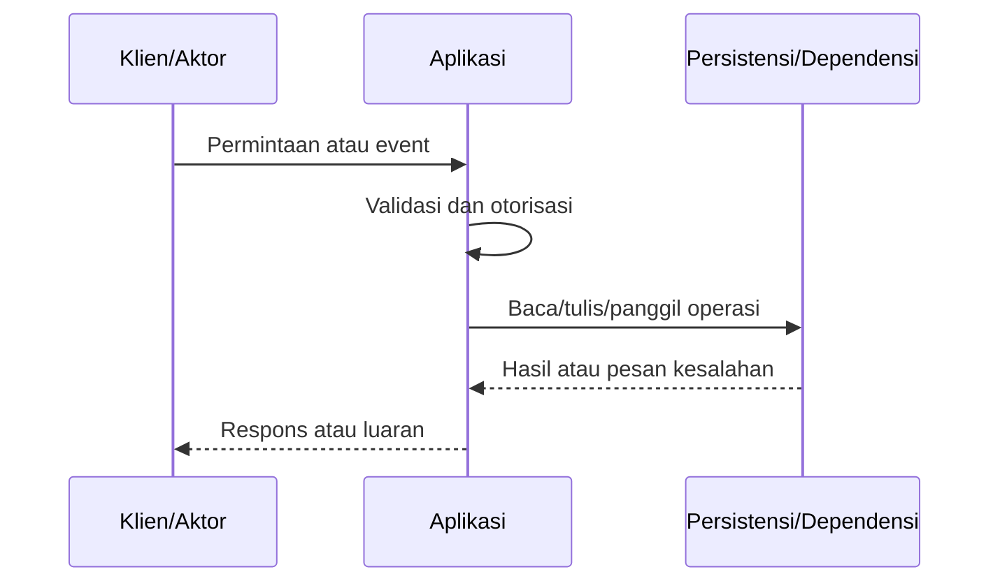

# Arsitektur & Diagram Urutan — {{PROJECT_NAME}}

## 1. Konteks Sistem (System Context)

Gunakan diagram berikut sebagai garis dasar (*baseline*) dan sesuaikan dengan komponen yang benar-benar digunakan:

## 2. Tanggung Jawab Komponen (Component Responsibilities)

- Titik masuk / antarmuka: {{ENTRYPOINTS}}
- Aplikasi / layanan inti: {{CORE_COMPONENTS}}
- Persistensi / penyimpanan: {{PERSISTENCE_COMPONENTS}}
- Pemrosesan asinkron / antrean: {{ASYNC_COMPONENTS}}
- Dependensi eksternal: {{EXTERNAL_DEPENDENCIES}}

Setiap komponen harus memiliki satu tanggung jawab utama (*single responsibility*) dan antarmuka yang jelas.

## 3. Diagram Urutan Utama (Primary Sequence Diagram)

## 4. Batasan Lingkungan Kerja (Runtime Boundaries)

- Runtime / platform: `{{RUNTIME}}`
- Antarmuka publik: {{PUBLIC_INTERFACES}}
- Antarmuka internal: {{INTERNAL_INTERFACES}}
- Batasan konfigurasi dan rahasia: {{CONFIGURATION_BOUNDARY}}
- Batas sumber daya (Resource limits): {{RESOURCE_LIMITS}}
- Model ketersediaan & skalabilitas: {{SCALING_MODEL}}

## 5. Keputusan Arsitektur

Catat keputusan penting yang memengaruhi kompatibilitas, integritas data, keamanan, operabilitas, atau biaya. Tautkan keputusan ke requirement ID dan dokumen yang terdampak pada [Decision Register](../08-reference/decision-register.md).
