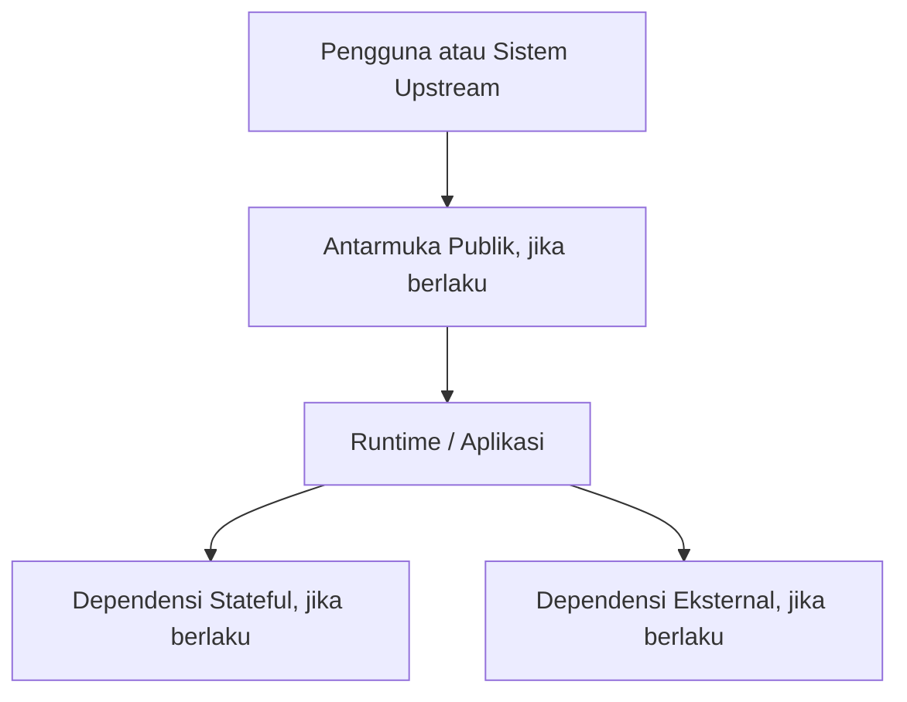

# Spesifikasi Server & Penyebaran — {{PROJECT_NAME}}

## 1. Konteks Penyebaran (Deployment Context)

Lingkungan target penyebaran: {{DEPLOYMENT_ENVIRONMENTS}}.

Dilarang menambahkan komponen, port, atau dependensi hanya karena ada pada template. Cantumkan hanya yang benar-benar digunakan oleh proyek.

## 2. Kategori Konfigurasi

- Konfigurasi runtime: {{RUNTIME_CONFIGURATION}}
- Konfigurasi rahasia (*secret configuration*): {{SECRET_CONFIGURATION}}
- Endpoint dependensi: {{DEPENDENCY_ENDPOINTS}}
- Batas sumber daya (Resource limits): {{RESOURCE_LIMITS}}
- Konfigurasi observabilitas: {{OBSERVABILITY_CONFIGURATION}}

Seluruh rahasia (*secrets*) wajib dimuat dari environment atau secret manager dan tidak boleh dimasukkan ke dalam source code, repositori, artefak, atau log.

## 3. Langkah-Langkah Penyebaran (Deployment Steps)

1. {{DEPLOY_STEP_1}}
2. {{DEPLOY_STEP_2}}
3. Validasi kesehatan aplikasi (*health check*), konektivitas dependensi, kontrol keamanan, dan jalankan uji asap (*smoke test*).
4. Catat versi rilis, hasil keluaran, dan referensi *rollback*.

## 4. Pembatalan Rilis (Rollback) & Kompatibilitas

- Pemicu pembatalan (*Rollback trigger*): {{ROLLBACK_TRIGGER}}
- Prosedur pembatalan (*Rollback procedure*): {{ROLLBACK_PROCEDURE}}
- Aturan kompatibilitas data / migrasi: {{DATA_COMPATIBILITY_RULE}}
- Estimasi waktu henti (*Downtime expectation*): {{DOWNTIME_EXPECTATION}}
