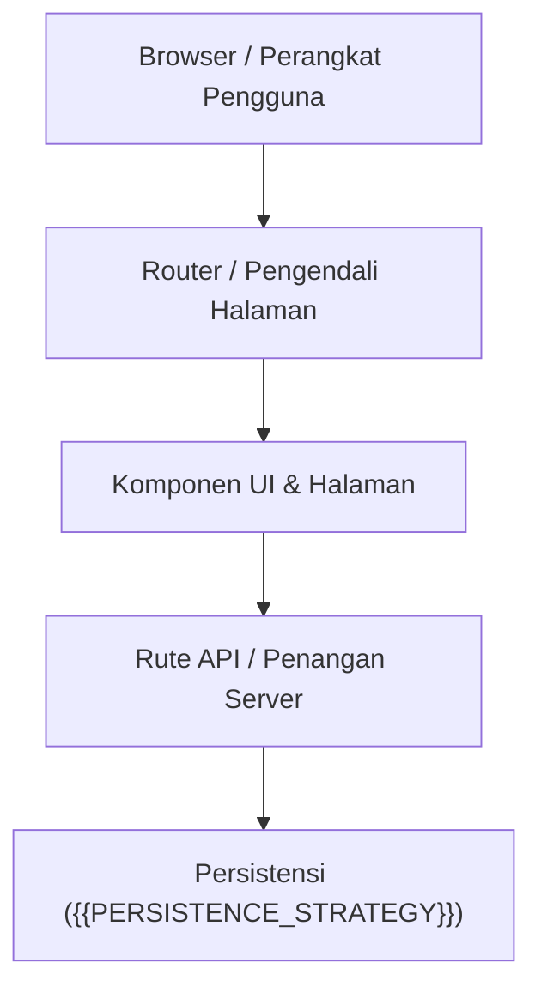

# Arsitektur Aplikasi Web — {{PROJECT_NAME}}

> {{PROJECT_MISSION}}

Dokumen ini menguraikan arsitektur tingkat tinggi, batasan sistem, dan alur permintaan-tanggapan (*request-response flow*) untuk aplikasi web {{PROJECT_NAME}}.

---

## 1. Gambaran Umum Sistem

{{PROJECT_NAME}} adalah aplikasi web MVP yang dirancang untuk kesederhanaan, kecepatan akses, dan iterasi cepat menggunakan {{FRAMEWORK_OR_PLATFORM}}.

---

## 2. Pilihan Stack Teknologi

| Lapisan | Pilihan Teknologi | Deskripsi |
|---|---|---|
| **Bahasa Utama** | `{{PRIMARY_LANGUAGE}}` | Bahasa inti untuk logika aplikasi dan komponen antarmuka |
| **Framework / UI** | `{{FRAMEWORK_OR_PLATFORM}}` | Perutean web, rendering tata letak, dan siklus hidup komponen |
| **Persistensi** | `{{PERSISTENCE_STRATEGY}}` | Basis data atau penyimpanan untuk state aplikasi |
| **Styling** | Modern CSS / Design Tokens | Gaya visual antarmuka yang responsif dan ringan |

---

## 3. Prinsip Desain Utama

1. **Jaga Tetap Sederhana (KISS)**: Utamakan kode framework yang bersih dan idiomatik daripada abstraksi berlebihan sejak dini.
2. **Mutasi State yang Deterministik**: Perubahan state terjadi melalui form action, rute API, atau event handler yang eksplisit.
3. **Penanganan Kegagalan Anggun (Graceful Degeneracy)**: Kesalahan formulir, timeout jaringan, atau data kosong menampilkan pesan ramah dan tindakan perbaikan bagi pengguna.
4. **Pemuatan Awal Cepat**: Minimalkan pustaka runtime berukuran besar demi menjaga ukuran bundle tetap ramping.
