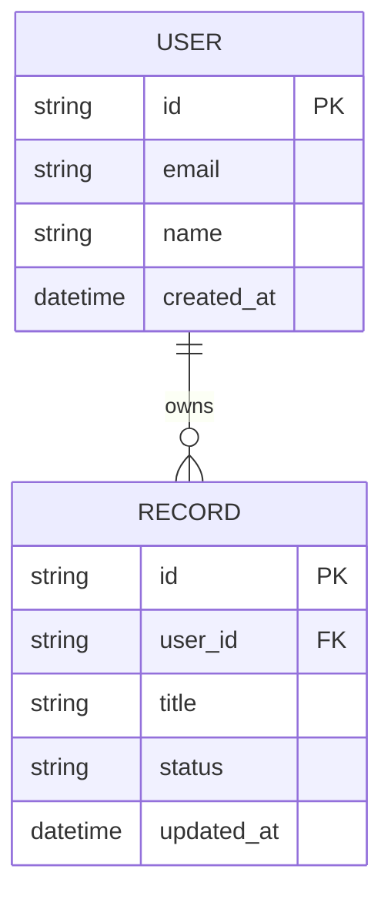

# Skema Data & Panduan Persistensi — {{PROJECT_NAME}}

> Model persistensi, entitas data, dan operasi penyimpanan untuk {{PROJECT_NAME}}.

---

## 1. Gambaran Strategi Persistensi

Aplikasi menyimpan catatan data menggunakan **`{{PERSISTENCE_STRATEGY}}`**.

### Kebutuhan Penyimpanan
- Inisialisasi ringan dengan beban operasional minimal atau nol.
- Migrasi atau sinkronisasi skema yang deterministik.
- Integritas transaksional untuk operasi tulis data pengguna.

---

## 2. Entitas Inti

### Definisi Entitas

#### 1. Pengguna (`users`)
- `id` (String / UUID, Primary Key): Pengenal unik akun.
- `email` (String, Unique): Alamat email pengguna.
- `created_at` (DateTime): Waktu pendaftaran akun.

#### 2. Catatan Proyek (`records`)
- `id` (String / UUID, Primary Key): Pengenal unik catatan.
- `user_id` (String, Foreign Key): ID pengguna pemilik data.
- `title` (String): Judul atau deskripsi entri data.
- `status` (String): Status alur kerja saat ini (contoh: `pending`, `active`, `archived`).
- `updated_at` (DateTime): Waktu modifikasi terakhir.

---

## 3. Keamanan Data dan Pencadangan

1. **Pengembangan Lokal**: Simpan file basis data lokal (kecualikan dari git melalui `.gitignore`).
2. **Pencadangan (Backup)**: Siapkan snapshot otomatis atau ekspor berkala untuk `{{PERSISTENCE_STRATEGY}}`.
3. **Validasi**: Terapkan batasan skema pada lapisan aplikasi sebelum menulis data.
